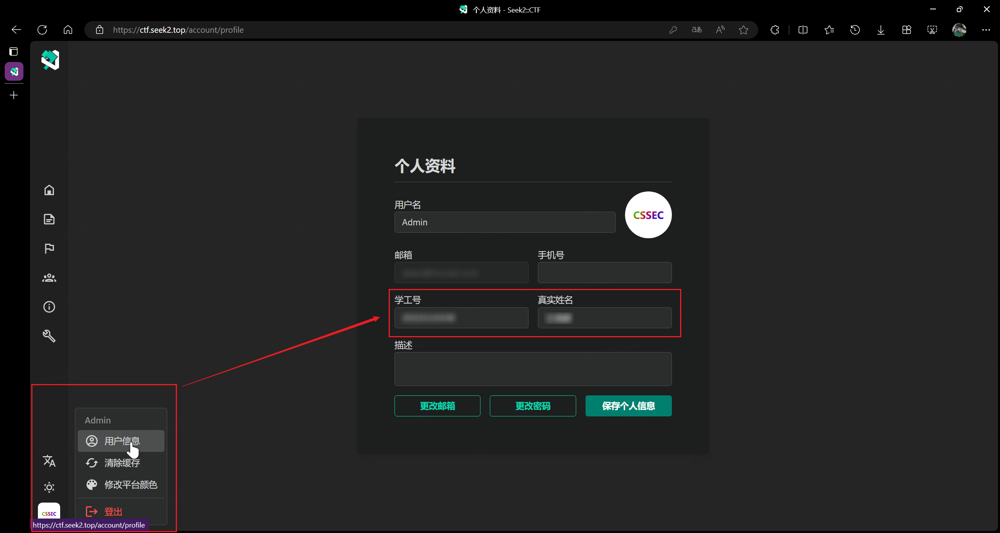

# CSSEC CTF Test 2024 参赛手册 2.0

时间：2024 年 6 月 20 日 14:00-18:00，共 4 小时  
地点：第一实验楼西 402（2 班），403（3 班）  
平台：https://ctf.seek2.top

为确保同学们参赛顺利，请同学们仔细阅读本手册，如有疑问，请及时联系我们。

### 一、比赛报名

#### 报名前请确保：

1. 已经在 **用户信息** 页面完善了个人信息，包括姓名，学号。

2. 已创建一支个人队伍（单人），队伍名称无要求。

#### 报名

1. 选择个人队伍（单人）
2. 选择比赛：`CSSEC CTF Test 2024`
3. 输入邀请码：`CSSEC CTF @ 2024`
4. 选择对应班级

### 二、比赛规则

1. 赛制为线下 CTF 个人赛，赛题涵盖 Web，Pwn，Misc，Reverse，Crypto 五个方向。题目较为简单，新手食用一般无不良反应。
2. 所有题目初识分值为 1000 分，随解题人数增加，分值将逐渐降低，直至最低 250 分。前三解题选手将分别奖励题目最终分值的 5%，3%，1% 加入总分。
3. 最终排名根据每位选手的总分确定，在得分相同得分相同的情况下，越早达到这一分值的选手排名越高。最终考核分数将根据排名进行转换，最低 50 分，最高 100 分。
4. 大多数情况下，题目 flag 字符串的形式为 `CSSEC{...}` 或 `flag{...}`，如有特殊情况，题目描述中会有说明。

### 三、注意事项

1. 请各位同学自带电脑，并提前安装好所需的工具。本次比赛无特殊网络需求，同学们可自行连接校园网或个人热点。
2. 禁止不同参赛人员合作，共享 flag、hint 等任何比赛相关信息。
3. 禁止攻击比赛平台，如果发现平台漏洞，请务必向我们报告。
4. 禁止爆破平台与题目，本次比赛所有题目均不需要爆破。

### 四、比赛结束

所有选手需在 **比赛结束 12 小时内** 提交解题文档（writeup）至指定邮箱，未准时或未按照要求提交文档的，将可能影响最终排名，请各位同学务必重视！

1. 收件邮箱：`clear@stu.sicnu.edu.cn`。
2. 邮件主题：`CTF WP 姓名 学号`。
3. 文档格式为 PDF，文件名为 `CTF-WP-姓名-学号.pdf`。
4. 文档需要包含 **解题思路、过程截图** 等信息。使用了工具和脚本的，需要提供工具名和脚本的完整代码。

---

本次比赛由 信安组（CSSEC）承办，感谢 _@Sonder39，@y1shin，@zhajiangmian，@abaichuan，@QING_ 对本次比赛的支持与帮助。预祝各位同学比赛顺利！
